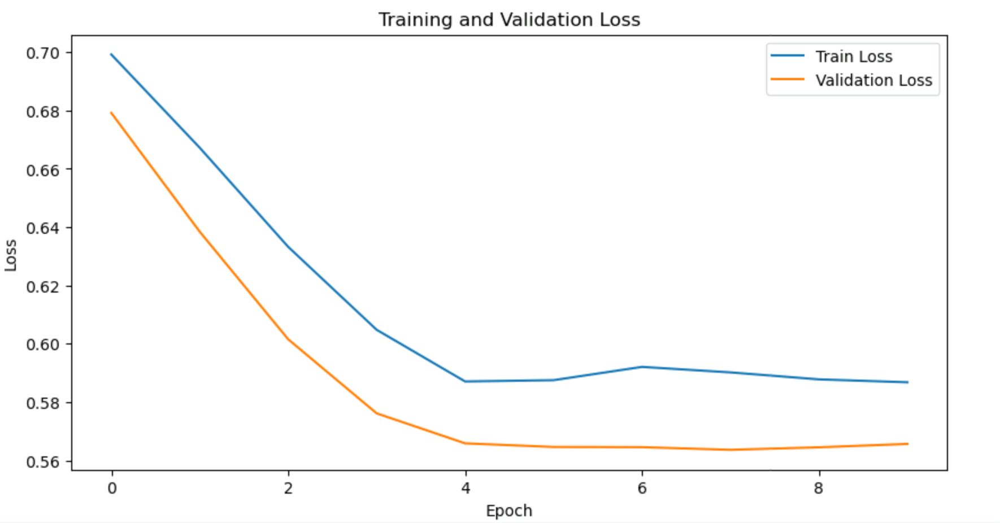
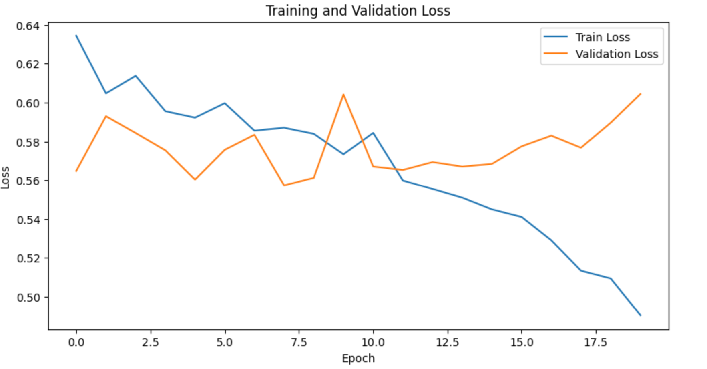

# Experiments

## 1. Custom Network

### 1.1. Architecture

1
```python
#Example network
class CustomNet(nn.Module):
    def __init__(self):
        # In the constructor we will specify those processing blocks which require learnable parameters
        # We just define them to ensure persistence during training, although they will remain disconnected
        # until we define a processing pipeline in forward method.
        super(CustomNet, self).__init__()

        #2D convolution to operate over RGB images
        self.conv1 = nn.Conv2d(3, 16, 3)
        # Maxpooling with kernel 2x2 and stride=2
        self.pool = nn.MaxPool2d(3, 2)
        # 2D convolution
        self.conv2 = nn.Conv2d(16, 32, 3)
        # 2D convolution
        self.conv3 = nn.Conv2d(32, 64, 3)
        # 2D convolution
        self.conv4 = nn.Conv2d(64, 128, 3)
        # Fully-connected layer which expects a linearized vector input (after flattening)
        # and produces 120 channels at the output
        self.fc1 = nn.Linear(40000, 1000)
        # Fully-connected layer 
        self.fc2 = nn.Linear(1000, 128)
        # Fully-connected layer 
        self.fc3 = nn.Linear(128, 32)
        # Fully-connected layer 
        self.fc4 = nn.Linear(32, 2)

    #In forward method we connect layers and define the processing pipeline of the network
    def forward(self, x):
        #Convolutional Blocks => Conv -> Relu -> pool
        x = self.pool(F.relu(self.conv1(x)))
        x = self.pool(F.relu(self.conv2(x)))
        x = self.pool(F.relu(self.conv3(x)))
        # x = self.pool(F.relu(self.conv4(x)))
        #Flatten method vectorizes the spatial output of size hxwxchannels into a vector of length h*w*channels
        #by setting the parameter to 1, we start to flatten in dim=1 and do not vectorize the dimension representing
        #the images in the batch
        x = x.flatten(1)
        
        #Fully connected blocks => Linear -> Relu
        x = F.relu(self.fc1(x))
        x = F.relu(self.fc2(x))
        x = F.relu(self.fc3(x))
        x = self.fc4(x)

        return x
    

customNet = CustomNet()
customNet.to(device) #copy the network to the device (gpu)
#Loss function
criterion = nn.CrossEntropyLoss()
# SGD with momentum 
optimizer_ft = optim.SGD(customNet.parameters(), lr=1e-2, momentum=0.9)
# An lr strategy which decreases lr by a factor of 0.1 every 10 epochs
exp_lr_scheduler = lr_scheduler.StepLR(optimizer_ft, step_size=10, gamma=0.1)
```


Very poor performing, the model is not able to overfit, so we must increase the size and also check the learning rate

$AUC = 0.5237$, $Loss = 0.5657$



---
2 

```python
#Example network
class CustomNet(nn.Module):
    def __init__(self):
        # In the constructor we will specify those processing blocks which require learnable parameters
        # We just define them to ensure persistence during training, although they will remain disconnected
        # until we define a processing pipeline in forward method.
        super(CustomNet, self).__init__()

        #2D convolution to operate over RGB images
        self.conv1 = nn.Conv2d(3, 16, 3)
        self.conv2 = nn.Conv2d(16, 16, 3)
        self.conv3 = nn.Conv2d(16, 32, 3)
        self.conv4 = nn.Conv2d(32, 32, 3)
        self.conv5 = nn.Conv2d(32, 64, 3)
        self.conv6 = nn.Conv2d(64, 64, 3)
        self.conv7 = nn.Conv2d(64, 128, 3)
        self.conv8 = nn.Conv2d(128, 128, 3)
        # Maxpooling with kernel 2x2 and stride=2
        self.pool = nn.MaxPool2d(2)
        # Fully-connected layer which expects a linearized vector input (after flattening)
        # and produces 120 channels at the output
        self.fc1 = nn.Linear(12800, 4096)
        # Fully-connected layer 
        self.fc2 = nn.Linear(4096, 1024)
        # Fully-connected layer 
        self.fc3 = nn.Linear(1024, 2)

    #In forward method we connect layers and define the processing pipeline of the network
    def forward(self, x):
        #Convolutional Blocks => Conv -> Relu -> pool
        x = self.pool(F.relu(self.conv2(F.relu(self.conv1(x)))))
        x = self.pool(F.relu(self.conv4(F.relu(self.conv3(x)))))
        x = self.pool(F.relu(self.conv6(F.relu(self.conv5(x)))))
        x = self.pool(F.relu(self.conv8(F.relu(self.conv7(x)))))
        #Flatten method vectorizes the spatial output of size hxwxchannels into a vector of length h*w*channels
        #by setting the parameter to 1, we start to flatten in dim=1 and do not vectorize the dimension representing
        #the images in the batch
        x = x.flatten(1)
        
        #Fully connected blocks => Linear -> Relu
        x = F.relu(self.fc1(x))
        x = F.relu(self.fc2(x))
        x = self.fc3(x)

        return x
```

Now using adam optimizer with $lr=1e-4$, still have a plateu, will try with another scheduler

---
3
Now using the plateu we improve the results a little bit
$AUC = 0.5637$

4
Use num workers and pin_memory to speed up training

---
5
```python
#Example network
class CustomNet(nn.Module):
    def __init__(self):
        # In the constructor we will specify those processing blocks which require learnable parameters
        # We just define them to ensure persistence during training, although they will remain disconnected
        # until we define a processing pipeline in forward method.
        super(CustomNet, self).__init__()

        #2D convolution to operate over RGB images
        self.conv1 = nn.Conv2d(3, 8, 5)
        # Maxpooling with kernel 2x2 and stride=2
        self.pool = nn.MaxPool2d(2, 2)
        # 2D convolution
        self.conv2 = nn.Conv2d(8, 16, 3)
        # 2D convolution
        self.conv3 = nn.Conv2d(16, 32, 3)
        # 2D convolution
        self.conv4 = nn.Conv2d(32, 64, 3)
        # Fully-connected layer which expects a linearized vector input (after flattening)
        # and produces 120 channels at the output
        self.fc1 = nn.Linear(21632, 1000)
        # Fully-connected layer 
        self.fc2 = nn.Linear(1000, 128)
        # Fully-connected layer 
        self.fc3 = nn.Linear(128, 32)
        # Fully-connected layer 
        self.fc4 = nn.Linear(32, 2)

    #In forward method we connect layers and define the processing pipeline of the network
    def forward(self, x):
        #Convolutional Blocks => Conv -> Relu -> pool
        x = self.pool(F.relu(self.conv1(x)))
        x = self.pool(F.relu(self.conv2(x)))
        x = self.pool(F.relu(self.conv3(x)))
        # x = self.pool(F.relu(self.conv4(x)))
        #Flatten method vectorizes the spatial output of size hxwxchannels into a vector of length h*w*channels
        #by setting the parameter to 1, we start to flatten in dim=1 and do not vectorize the dimension representing
        #the images in the batch
        x = x.flatten(1)
        
        #Fully connected blocks => Linear -> Relu
        x = F.relu(self.fc1(x))
        x = F.relu(self.fc2(x))
        x = F.relu(self.fc3(x))
        x = self.fc4(x)

        return x

#Repeat network definition
customNet = CustomNet()
customNet.to(device) #copy the network to the device (gpu)
#Loss function
criterion = nn.CrossEntropyLoss()

# SGD with momentum 
optimizer_ft = optim.Adam(customNet.parameters(), lr=1e-5)

# An lr strategy which decreases lr by a factor of 0.1 every 10 epochs
exp_lr_scheduler = lr_scheduler.StepLR(optimizer_ft, step_size=10, gamma=0.1)
```

We get a AUC of 0.55 more or less and a loss of 0.58

---
6

Now the same but with a lr of 1e-4 it goes really better, now we get:

AUC=0.68, Loss=0.55

But the validation is AUC=0.62, which is a sign of overfitting, after the 10th epoch the plateu starts to appear

---
7 

Now with lr of 1e-3 it starts well, there is a plateu and after decreasing the lr it goes down like



AUC=0.77 and Loss of 0.49, but now there is really overfitting, the validation loss does not go above 0.6.

---
8 

Finally, lets implement the plateu scheduler. It worsens it since it does not
really take the learning rate down

---
9 

Now we have tried a bigger network, but, as it can be expectable, it does not really what to do since we do not have much data, so we will use a bigger
dataset with 1000 thousand images


## 2. Fine-tuning

### 2.1. Architecture

1. AlexNet

With `optimizer_ft = optim.SGD(ftNet.parameters(), lr=1e-3, momentum=0.9)` 
we have, for 10 epochs:

train Loss: 0.5217 AUC: 0.7274
val Loss: 0.5830 AUC: 0.6390

Without Plateu

2. ResNet

Works a lot better, with the same optimizer and the same epochs
the only problem is that we start to have overfitting, we should work on better transforms
for better generalization. 

The AUC is almost the same in validation for
all the training

Epoch 9/9


train Loss: 0.1555 AUC: 0.9811

val Loss: 1.0642 AUC: 0.7511


3. VGG16

It has a horrible performance, does not even overfit, the AUC is 0.5 or below

Epoch 9/9

train Loss: 0.8708 AUC: 0.4858

val Loss: 0.8426 AUC: 0.4557

4. Efficient Net

It has also very good performance, but not as good as ResNet

Epoch 9/9

train Loss: 0.2141 AUC: 0.9657

val Loss: 0.6480 AUC: 0.7541

Although we have the same problem with overfitting

5. SqueezeNet

SqueezeNet provides good results without too much overfitting, but they definitely could be better.

Epoch 9/9

train Loss: 0.4860 AUC: 0.7786

val Loss: 0.5344 AUC: 0.7067

6. ConvXNet

Although it is a big model, it does not perform good

---
**Second iteration**

1. ResNet

By doing more transformations we get a better generalization, but we need
further training:

Epoch 19/19

train Loss: 0.4397 AUC: 0.8186

val Loss: 0.5074 AUC: 0.7461